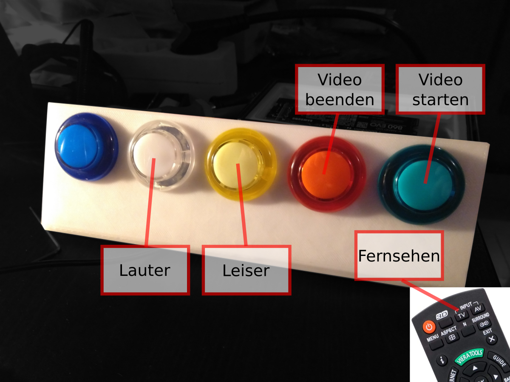

# Video Call Controller
A python controller to allow my elderly parents to easily join jitsi meetings (for now) with switching their TV-input (no CeC yet) and pressing a single hardware button on a panel.

### Uses
* tkinter as GUI
* cefpython to embed chromium for webrtc usage
* serial communication for the hardware buttons (run by an arduino) (with reconnection detection)

### Usage
fire up in fullscreen, let parents hit video button,
(first run needs some settings do be done with a mouse in jit.si ... )
join yourself to the same room using a client of choice (browser)

This is just a firts entry, needs more documentation and love and is in early stage

#### my TODO:
* add docs
* add install dependencies (python and ubuntu)
* describe hardware (panel and computer)
* add more functionality (e.g. picture browser for familymembers instagram, sitgnal notification with randomized room, )
* autoupdates

##### stuff:
* [chromium command line switches](https://peter.sh/experiments/chromium-command-line-switches/)
